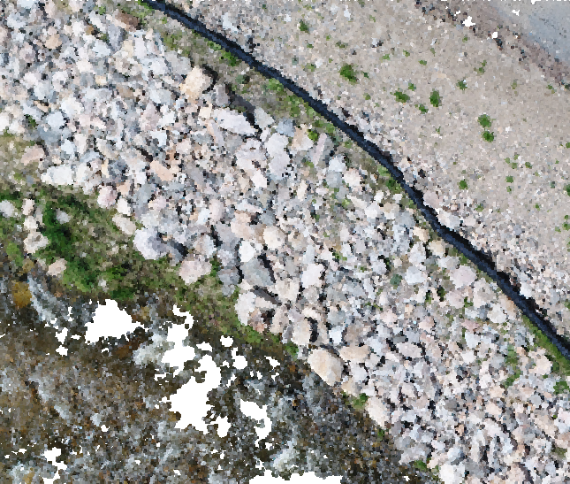
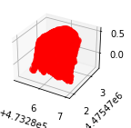
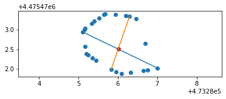

<!-- PROJECT SHIELDS -->
[![MIT License][license-shield]][license-url]
[![Issues][issues-shield]][issues-url]
[![LinkedIn][linkedin-shield]][linkedin-url]

<!-- TABLE OF CONTENTS -->

  
Table of Contents

  <ol>
    <li>
      <a href="#about-the-project">About The Project</a>
      <ul>
        <li><a href="#built-with">Built With</a></li>
      </ul>
    </li>
    <li>
      <a href="#getting-started">Getting Started</a>
      <ul>
        <li><a href="#prerequisites">Prerequisites</a></li>
        <li><a href="#installation">Installation</a></li>
      </ul>
    </li>
    <li><a href="#usage">Usage</a></li>
    <li><a href="#roadmap">Roadmap</a></li>
    <li><a href="#contributing">Contributing</a></li>
    <li><a href="#license">License</a></li>
    <li><a href="#contact">Contact</a></li>
    <li><a href="#acknowledgments">Acknowledgments</a></li>
  </ol>

<!-- ABOUT THE PROJECT -->
## About The Project: Rockie - Riprap Analysis Tool

Within the construction business, riprap is a commonly used material for erosion control. It is a layer of large stones that are placed along the banks of rivers, streams, and other waterways to prevent erosion. The size and shape of the stones are important to the effectiveness of the riprap. The stones must be large enough to resist being washed away by the water, but not so large that they are difficult to handle and place. The stones must also be of a shape that will interlock with the other stones in the riprap to form a stable layer. The stones are typically placed in a layer that is 1 to 2 feet thick. The stones are placed by hand or by using heavy equipment such as a backhoe or a front-end loader. The stones are placed in a random pattern, but the layer must be thick enough to prevent the stones from being washed away by the water. The stones are typically placed in a layer that is 1 to 2 feet thick. The stones are placed by hand or by using heavy equipment such as a backhoe or a front-end loader. The stones are placed in a random pattern, but the layer must be thick enough to prevent the stones from being washed away by the water.

In many situations the riprap is placed in a location where it is difficult to see the stones after they have been placed. This makes it difficult to determine if the stones are the correct size and shape. The Rockie tool is designed to help with this problem. The tool processes 3d point cloud data to determine the size and shape of the stones in the riprap. The tool can be used to determine if the stones are the correct size and shape, and if they are placed in a layer that is thick enough to prevent them from being washed away by the water.

### Workflow

1. Processes the 3d point cloud to only include the riprap area
   
2. Segments the riprap into individual stones
   
3. Perform a statistical analysis on the stones to determine the volume, size, and shape of the stones
   

(<a href="#readme-top">back to top</a>)

<!-- MARKDOWN LINKS & IMAGES -->
[issues-shield]: https://img.shields.io/github/issues/othneildrew/Best-README-Template.svg?style=for-the-badge
[issues-url]: https://github.com/Saul-the-engineer/projects/issues
[license-shield]: https://img.shields.io/github/license/othneildrew/Best-README-Template.svg?style=for-the-badge
[license-url]: https://github.com/Saul-the-engineer/projects/blob/main/LICENSE
[linkedin-shield]: https://img.shields.io/badge/-LinkedIn-black.svg?style=for-the-badge&logo=linkedin&colorB=555
[linkedin-url]: https://www.linkedin.com/in/saulramirez/
[product-screenshot]: images/screenshot.png